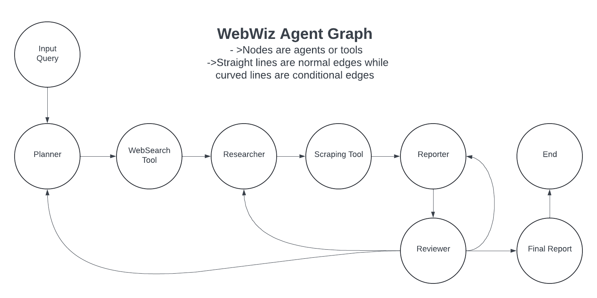

# Webwiz

WebWiz is a multi-agentic web search agent which uses LangGraph to implement agentic workflow to give you the best web search results. It is comprised of various agents and tools like Planner, websearch, Researcher, Scraping, Reporter, Reviewer tool. It is compatible with OpenAI, Gemini, Cluade and Groq. It even has a chainlit frontend.

### WebWiz Agent Graph:


### How to run
1. **Clone the Repo:**
   ```bash
   git clone https://github.com/WhiteWolf47/WebWiz.git
   ```

2. **Navigate to the Repo:**
   ```bash
   cd /path/to/your-repo/webwiz
   ```

3. **Install Requirements:**
   ```bash
   pip install -r requirements.txt
   ```

### Configure API Keys
1. **Open the `config.yaml`:**
   ```bash
   nano config.yaml
   ```

2. **Enter API Keys:**
   - **Serper API Key:** Get it from [https://serper.dev/](https://serper.dev/)
   - **OpenAI API Key:** Get it from [https://openai.com/](https://openai.com/)
   - **Gemini API Key:** Get it from [https://ai.google.dev/gemini-api](https://ai.google.dev/gemini-api)
   - **Claude API Key:** Get it from [https://docs.anthropic.com/en/api/getting-started](https://docs.anthropic.com/en/api/getting-started)
   - **Groq API Key:** Get it from [https://console.groq.com/keys](https://console.groq.com/keys)

### Run the front end
If you want to run the front end

For Linux, run:
```bash
chmod +x run_linux.sh
run_linux.sh
```

### Run Your Query In Shell
```bash
python -m app.app
```
Then enter your query.
